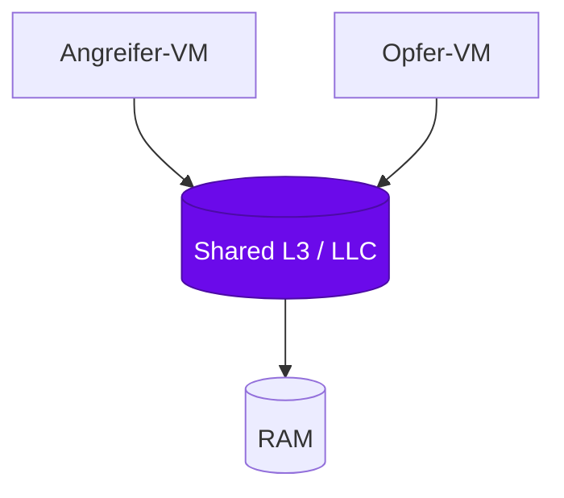
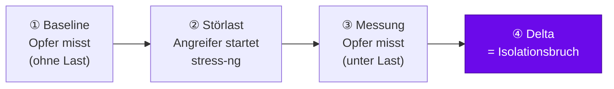
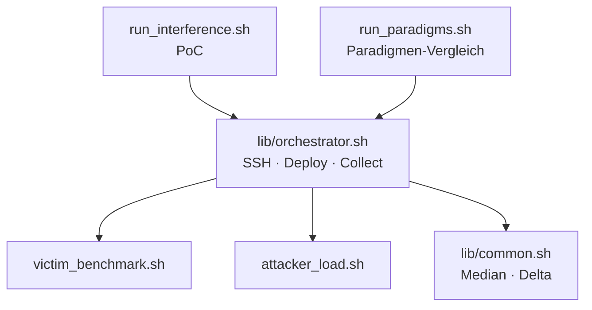

# Der Noisy-Neighbor-Effekt

<div class="kicker mt-1">Noisy Neighbor · Proxmox VE · Raptor Lake</div>

<div class="lead mt-3">Mikroarchitektonische Ressourcen-Interferenzen in virtualisierten Umgebungen</div>

<div class="pt-8 opacity-80 leading-relaxed">
  <b>Maximilian Wagner</b><br>
  Hardware-Sicherheit · Technische Hochschule Brandenburg<br>
  <span class="text-sm">Proxmox VE · Intel Raptor Lake · Praxisprojekt</span>
</div>

<!--
Begrüßung. Heute stelle ich den experimentellen Teil meiner Arbeit vor:
Wie lässt sich nachweisen, dass sich virtuelle Maschinen über geteilte Hardware
gegenseitig ausbremsen — obwohl sie logisch isoliert sein sollten?
-->

---
layout: two-cols
---

# Agenda

<v-clicks>

1. **Motivation** — warum dieses Thema?
2. **Hintergrund** — Virtualisierung & Shared Cache
3. **Technische Umsetzung** — der Homeserver
4. **Experiment-Topologie** — der Versuchsaufbau
5. **Methodik** — wie wird gemessen?
6. **Codebasis** — die Automatisierung
7. **Ergebnisse** — PoC & Paradigmen-Vergleich
8. **Fazit & Ausblick**

</v-clicks>

::right::

<div class="mt-16 ml-6 p-4 border-l-4 border-s1 bg-s1/10 rounded-r-lg opacity-90">

**Roter Faden**

Von der abstrakten Bedrohung (logische Isolation ist nicht gleich physische
Isolation) hin zum konkreten, messbaren Beweis auf eigener Hardware.

</div>

<!--
Kurz durch die Agenda. Schwerpunkt liegt klar auf dem praktischen Teil:
Aufbau, Code und Ergebnisse.
-->

---
layout: section
---

# 1 · Motivation

Warum „Noisy Neighbor"?

---

<div class="kicker">Motivation</div>

# Das Problem: geteilte Hardware

<div grid="~ cols-2 gap-8" class="mt-4">

<div>

**Cloud & Multi-Tenancy**

- Mehrere Mandanten teilen sich **einen** physischen Server
- Virtualisierung garantiert **funktionale** Isolation (Speicher, Prozesse)
- **Aber:** CPU-Caches, Speicherbandbreite und I/O bleiben **physisch geteilt**

</div>

<div>

**Der Noisy-Neighbor-Effekt**

- Ein „lauter Nachbar" sättigt gezielt eine geteilte Ressource
- Koexistierende VMs werden spürbar langsamer
- Angriffsvektor: **Denial of Service** über die Mikroarchitektur

</div>

</div>

<div class="mt-8 p-4 bg-s1/10 rounded border border-s1">

> Logische Isolation ≠ physische Isolation. Der **Last Level Cache (LLC)** ist
> die zentrale geteilte Ressource — und damit die Angriffsfläche.

</div>

<!--
Kernbotschaft: Der Hypervisor trennt sauber, was Software sieht. Was er NICHT
trennen kann, ist die geteilte physische Hardware darunter. Genau dort setzt der
Angriff an. NIST SP 800-125A benennt dieses systemische Risiko explizit.
-->

---

# Themenwahl & Forschungsfrage

<div grid="~ cols-2 gap-8">

<div>

**Warum dieses Thema?**

- Schnittstelle aus **Hardware-Sicherheit** und **Systemvirtualisierung**
- Praktisch auf eigener Hardware **reproduzierbar**
- Anknüpfung an die Basisaufgabe 3.4 (Emulation / Para-Virt. / Virtualisierung)

</div>

<div>

**Forschungsfrage**

</div>

</div>

<div class="mt-2 p-5 text-xl text-center border-2 border-s1 rounded-lg">

Lässt sich ein Isolationsbruch durch <b>Cache-Interferenz</b> auf moderner
Consumer-Hardware <span class="mark">quantitativ messbar</span> nachweisen?

</div>

<div class="mt-6 text-sm opacity-80">

**Vorgehen:** primär der **PoC** (aktiver Angriff, ein Opfer) — er greift
eindeutig. Ergänzend ein systematischer **Vergleich** der drei
Virtualisierungs­paradigmen unter identischer Störlast (Isolationsstärke).

</div>

<!--
Die Forschungsfrage ist bewusst quantitativ formuliert: Es geht nicht um "gibt es
das", sondern um "wie groß ist der messbare Effekt". Ursprünglich war der
Paradigmen-Vergleich als Rückfallebene gedacht, falls der Angriff scheitert — der
PoC greift aber eindeutig, also ist der Vergleich jetzt eine ergänzende Einordnung.
-->

---
layout: section
---

# 2 · Hintergrund

Drei Paradigmen & der geteilte Cache

---

# Drei Virtualisierungs-Paradigmen

<div grid="~ cols-3 gap-4" class="mt-8">

<div class="card">

### Emulation
**QEMU (TCG)**

CPU-Befehle werden in Software nachgebildet.

- Maximale Isolation
- Maximaler Overhead (~Faktor 30–40)

</div>

<div class="card">

### Para-Virtualisierung
**LXC (Container)**

Geteilter Host-Kernel, OS-Level-Isolation.

- Nahezu native Leistung
- Schwächste Isolationsgrenze

</div>

<div class="card card-accent">

### Virtualisierung
**KVM (HW-gestützt)**

Hardware-Beschleunigung (VT-x).

- Native Leistung
- Robuste Isolation

</div>

</div>

<div class="mt-8 text-center opacity-80">

Zunehmende Isolation ⟶ zunehmender Overhead. Die spannende Frage:
**Wie verhält sich diese Isolation unter aktiver Störlast?**

</div>

<!--
Diese drei bilden die Grundlage. Wichtig für später: LXC ist am schnellsten, aber
teilt sich am meisten mit dem Host — Hypothese ist, dass LXC unter Störlast am
stärksten einbricht. KVM sollte robuster sein.
-->

---
layout: two-cols
---

# Geteilter Last Level Cache

Auf **Intel Raptor Lake** teilen sich alle P-Cores **einen** L3-Cache (LLC).

<div class="mt-4">

- Angreifer & Opfer auf **demselben physischen Kern**
- Angreifer verdrängt permanent fremde Cache-Lines (*Eviction*)
- Opfer erleidet Cache-Misses → höhere Latenz, weniger Durchsatz

</div>

<div class="mt-6 p-3 bg-s1-magenta/10 border border-s1-magenta rounded text-sm">
Das Opfer „sieht" nur, dass es langsamer wird — die Ursache bleibt hinter der
Hardware-Abstraktion verborgen.
</div>

::right::

<div class="ml-6 mt-12">



</div>

<!--
Das ist der mikroarchitektonische Kern. Der LLC ist die letzte Cache-Stufe vor dem
RAM. Wer ihn flutet, zwingt den Nachbarn zu teuren RAM-Zugriffen.
-->

---
layout: section
---

# 3 · Technische Umsetzung

Der Homeserver

---
layout: two-cols
---

<script setup>
const base = import.meta.env.BASE_URL
</script>

# Homeserver: Proxmox VE

**Hardware**

- Lenovo ThinkCentre M70s Gen 4
- **Intel Core i7-13700** (Raptor Lake, Hybrid)
- 32 GB DDR4-3200
- NVMe-SSD (System)

**Plattform**

- Proxmox VE (`pve` @ `192.168.178.50`)
- KVM-VMs **und** LXC-Container nativ
- Netz: vmbr0 (Heimnetz, 2,5 Gbit/s)

::right::

<div class="ml-6">


<div class="mt-2 text-xs opacity-60 text-center">
Lenovo ThinkCentre M70s · Intel i7-13700 · Proxmox VE
</div>

</div>

<!--
Hier die Hardware zeigen. Wichtig: Es ist Consumer-Hardware, kein Server-Xeon —
das unterstreicht, dass der Effekt nicht exotisch ist. Foto vom Gerät einblenden.
-->

---

# Host-Determinismus (zwingend)

Ohne deterministische Taktbasis sind Latenzmessungen **wertlos** — moderne CPUs
takten ständig dynamisch um.

<div grid="~ cols-3 gap-4" class="mt-6">

<div class="card">

**C-States aus**

```text
intel_idle.max_cstate=1
processor.max_cstate=1
idle=poll
```

</div>

<div class="card">

**Turbo Boost aus**

```bash
echo 1 > .../intel_pstate/no_turbo
```

</div>

<div class="card">

**Governor: performance**

```bash
echo performance > \
  .../scaling_governor
```

</div>

</div>

<div class="mt-8 p-3 bg-s1/10 border border-s1 rounded text-center">
Erst dadurch werden Messungen <b>reproduzierbar</b> und vergleichbar.
</div>

<!--
Das ist ein oft unterschätzter Punkt. Wenn die CPU während der Messung hoch- und
runtertaktet, misst man Taktschwankungen statt Cache-Effekte. Deshalb: feste
Frequenz, keine Schlafzustände.
-->

---
layout: section
---

# 4 · Experiment-Topologie

Der Versuchsaufbau

---

<div class="kicker">Versuchsaufbau</div>

# Vier Instanzen auf einem P-Core


<!--
Das Herzstück. Alle vier Instanzen sind auf denselben physischen P-Core gepinnt
(CPU-Affinity 4,5). Die drei Opfer werden NACHEINANDER getestet — so ist immer nur
ein Opfer aktiv und teilt sich den Cache mit dem konstanten Angreifer. Der
Control-Node steuert alles per SSH, misst aber nicht selbst.
-->

---

# Warum dieses Design?

<div grid="~ cols-2 gap-8" class="mt-4">

<div>

**Ein Angreifer, drei Opfer**

- Angreifer = **konstante Störquelle**
- Nur **eine** Variable ändert sich: die Virtualisierung des Opfers
- Sequenzielle Läufe → sauberer Vergleich der Isolationsstärke

</div>

<div>

**Pinning auf einen P-Core**

- Erzwingt geteilten L1/L2/L3 (SMT-Geschwister `4,5`)
- Maximiert die messbare Interferenz
- Adressiert über Proxmox `CPU-Affinity`

</div>

</div>

<div class="mt-8 grid grid-cols-4 gap-3 text-center text-sm">
  <div class="chip chip-magenta">🗡️ Angreifer<br><code>.210</code></div>
  <div class="chip">🎯 QEMU<br><code>.211</code></div>
  <div class="chip">🎯 LXC<br><code>.212</code></div>
  <div class="chip chip-accent">🎯 KVM<br><code>.213</code></div>
</div>

<!--
Der methodische Clou: Indem der Angreifer konstant bleibt, isoliere ich exakt eine
Variable. Das macht den Vergleich wissenschaftlich sauber.
-->

---
layout: section
---

# 5 · Methodik

Wie wird gemessen?

---

# Messablauf: Baseline → Störlast → Delta



<div grid="~ cols-2 gap-8" class="mt-8">

<div>

**Werkzeuge am Opfer**

- `sysbench cpu` → Events/s (Rechenlast)
- `sysbench memory` → MiB/s (Bandbreite)
- `fio` (4K random write) → IOPS + p95-Latenz

</div>

<div>

**Werkzeug am Angreifer**

- `stress-ng --cache 2 --cache-level 3` (LLC-Eviction)
- `stress-ng --hdd 1` (I/O-Sättigung)

</div>

</div>

<div class="mt-4 text-sm opacity-80 text-center">
Jede Phase läuft <b>N-mal</b> — aggregiert wird der <b>Median</b> (robust gegen Ausreißer).
</div>

<!--
Vier Metriken decken beide geforderten Lastarten ab: Rechenaufgaben (CPU/RAM) und
I/O. Der Median statt Mittelwert macht die Ergebnisse robust gegen einzelne
Ausreißer.
-->

---
layout: section
---

# 6 · Codebasis

Die Automatisierung

---

# Architektur der Test-Suite

<div grid="~ cols-2 gap-6" class="mt-2">

<div>



</div>

<div class="text-sm">

**Control-Node-Skripte**
- `run_interference.sh` — PoC-Orchestrierung
- `run_paradigms.sh` — 3-Paradigmen-Vergleich
- `lib/orchestrator.sh` — geteilte SSH/Deploy-Logik

**Gast-Skripte** (per SSH ausgerollt)
- `victim_benchmark.sh` — misst
- `attacker_load.sh` — erzeugt Last

**Prinzip:** ein agnostisches Opfer-Skript läuft in **jedem** Gasttyp identisch.

</div>

</div>

<div class="mt-4 text-xs opacity-70 text-center">
Vollständig per <code>shellcheck</code> geprüft · Konfiguration zentral in <code>config.env</code>
</div>

<!--
Der Aufbau ist bewusst modular: Die gemeinsame Orchestrator-Lib wird von PoC und
Paradigmen-Vergleich geteilt. Das Opfer-Skript ist virtualisierungs-agnostisch —
derselbe Code läuft in QEMU, LXC und KVM. Das macht den Vergleich fair.
-->

---

# Code: kontrollierte Störlast

Der Angreifer wird über SSH **exakt** um die Messung herum gestartet und gestoppt:

```bash {all|3-5|8-10}{lines:true}
# attacker_load.sh — Störlast im Hintergrund; gestoppt wird IMMER explizit
build_cmd() {
  stress-ng --cache "$CACHE_WORKERS" --cache-level "$CACHE_LEVEL" \
            --hdd "$HDD_WORKERS" --hdd-bytes "$HDD_BYTES" \
            --timeout "$1" --metrics-brief   # Timeout = reines Sicherheitsnetz
}

start)  # PID merken → gezieltes Stoppen, kein verwaister Prozess
  nohup "${cmd[@]}" > "$WORKDIR/attacker.log" 2>&1 &
  echo "$!" > "$PID_FILE" ;;
```

<div class="mt-4 text-sm opacity-80">
Gestoppt wird <b>explizit</b> um die Messung herum (plus EXIT-Trap als Absicherung).
Das <code>--timeout</code> ist nur ein Sicherheitsnetz gegen verwaiste Läufe — kein knapp
kalkuliertes Budget, das <b>mitten</b> in der Messphase ablaufen könnte.
</div>

<!--
Hier sieht man die Kombination aus Cache- und I/O-Last. Wichtig: Gestoppt wird die
Last IMMER explizit um die Messung herum (plus EXIT-Trap); das --timeout ist nur ein
Sicherheitsnetz gegen verwaiste Prozesse, KEIN knapp kalkuliertes Budget. Ein zu knappes
Budget könnte mitten in der Messphase ablaufen (sysbench memory ist volumen-, nicht
zeitgebunden) und die Noisy-Neighbor-Werte still verfälschen. Läuft die Last unerwartet
schon nicht mehr, warnt der Stopp — die betroffene Phase gilt dann als nicht belastbar.
-->

---

# Code: Messen & Aggregieren

```bash {all|4|6-7|12}{lines:true}
# lib/orchestrator.sh — N Messläufe sammeln, Median bilden
collect_phase() {
  for i in $(seq 1 "$REPEATS"); do
    line="$(victim_run "$user" "$host" 2>>"$log")"   # SSH; Gast-Log daneben
    # "cpu_eps=..;iops=..;.." → Spalten extrahieren
    iops="$(sed -n 's/.*iops=\([^;]*\).*/\1/p' <<< "$line")"
    echo "$i;$cpu;$mem;$iops;$lat" >> "$out"
  done
}
# Median einer Spalte (robust gegen Ausreißer)
col_median() { tail -n +2 "$1" | cut -d';' -f"$2" | median; }
```

<div class="mt-3 text-sm opacity-80">
Ergebnis je Lauf: eine maschinenlesbare Zeile → CSV → direkt in LaTeX/Diagramm.
Das <code>stderr</code> der Gäste landet je Phase in einer <code>.log</code>-Datei daneben.
</div>

<div class="mt-3 p-3 bg-s1/10 border border-s1 rounded text-sm">

**Mess-Historie statt Überschreiben** — jeder Lauf wird <b>versioniert</b>
(`results/history/`) samt <code>meta.txt</code>: Determinismus-Schnappschuss vom Host
(Governor / Turbo / C-State), git-Commit, Parameter.

→ Läufe werden <span class="mark">vergleichbar</span> — z. B. **mit vs. ohne Determinismus** — statt in einer Datei zu verschwinden.

</div>

<!--
Wichtiger Punkt: Ergebnisse werden NICHT in eine Datei überschrieben, sondern jeder
Lauf landet versioniert unter results/history/ mit einer meta.txt. Die meta.txt
enthält einen objektiven Determinismus-Schnappschuss (direkt vom Host ausgelesen:
Governor, Turbo, C-State), den git-Commit und alle Parameter. Dadurch sind Läufe
reproduzierbar und direkt vergleichbar — etwa der Lauf ohne Determinismus gegen den
mit Determinismus. Der Datenfluss bleibt durchgängig automatisiert: SSH → CSV →
Median → Historie → Tabelle/Diagramm.
-->

---

# Live-Demo: die Pipeline läuft

<div class="text-sm opacity-80 mb-4">
Verkürztes Profil <code>demo.env</code> — <b>ein</b> Durchlauf, nur das KVM-Opfer.
Es geht um <b>„es läuft echt"</b>, nicht um belastbare Zahlen.
</div>

```bash
# vor dem Vortrag (einmalig): Werkzeuge + Skripte ausrollen
./run_interference.sh --config demo.env --install --deploy-only

# LIVE — nur die Messung (~30–45 s)
./run_interference.sh --config demo.env --no-deploy
```

<div grid="~ cols-2 gap-6" class="mt-6 text-sm">

<div>

**Was hier passiert**
- Baseline am Opfer messen
- Angreifer-Störlast starten
- erneut messen → **Delta**
- Median → CSV → Tabelle

</div>

<div>

**Bewusst klein gehalten**
- `REPEATS=1`, 5-Sekunden-Läufe
- kein Host-Determinismus nötig
- die **echten** Deltas: nächste Folie

</div>

</div>

<div class="mt-4 text-xs opacity-70 text-center">
Sicherheitsnetz: Mitschnitt des Laufs als Fallback, falls das Heimnetz streikt.
</div>

<!--
Hier lasse ich die Suite live laufen. Wichtig zu sagen: das demo.env ist absichtlich
winzig (ein Durchlauf, 5-s-Benchmarks, nur das KVM-Opfer) und OHNE Host-Determinismus
— es beweist, dass es echter, laufender Code ist, keine Folien-Behauptung. Die Zahlen
sind hier verrauscht und NICHT die Ergebnisse; die echten Deltas zeige ich gleich.
Falls das Netz spinnt: ich habe einen Mitschnitt als Fallback.
-->

---
layout: section
---

# 7 · Ergebnisse

PoC & Paradigmen-Vergleich

---

<div class="kicker">Ergebnis · PoC</div>

# PoC-Ergebnis: der Effekt ist eindeutig

<div class="absolute top-20 right-12 px-3 py-1 bg-s1/20 border border-s1 text-xs rounded">
KVM-Opfer · 10× · ohne Determinismus
</div>

Delta der Metriken am **KVM-Opfer**, Baseline vs. Noisy Neighbor:

<div class="mt-6">

| Metrik | Baseline | Noisy Neighbor | Delta |
|---|---|---|---|
| CPU (Events/s) | 1.683 | 1.326 | **−21,2 %** |
| Speicher (MiB/s) | 9.040 | 5.013 | **−44,6 %** |
| I/O (IOPS) | 78.943 | 40.761 | **−48,4 %** |
| Latenz p95 (ms) | 0,153 | 0,774 | <span class="hl-m">**+407 %**</span> |

</div>

<div class="mt-6 text-sm opacity-80">
Der Angreifer <b>halbiert</b> Speicherbandbreite und I/O — und <b>verfünffacht</b>
die p95-Latenz. Und das <b>sogar ohne</b> Host-Determinismus (Turbo an, C-States
offen = eigentlich Rauschquellen): Der Effekt dominiert das Rauschen klar.
</div>

<div class="mt-3 text-xs opacity-60">
Quelle: <code>results/history/interference_runs.csv</code> · Lauf <code>config/nodeterm</code>, Median über 10 Läufe.
Der Determinismus-Lauf (feste Taktbasis) schärft die Werte fürs Paper nur nach.
</div>

<!--
Das ist das Kern-Ergebnis. Wichtig zu betonen: Diese Zahlen entstanden OHNE
BIOS-Determinismus — Turbo an, C-States offen. Genau das sind eigentlich
Rauschquellen, und TROTZDEM ist der Effekt eindeutig (IOPS halbiert, Latenz mal
fünf). Mit Determinismus wird die Baseline nur enger, der Effekt bleibt. Die
Live-Demo vorhin war ein winziger Ableger dieses Laufs.
-->

---

<script setup>
const base = import.meta.env.BASE_URL
</script>

<div class="kicker">Ergebnis · Vergleich</div>

# Paradigmen-Vergleich: Isolationsstärke

<div class="absolute top-20 right-12 px-3 py-1 bg-s1/20 border border-s1 text-xs rounded">
config/nodeterm · 10×
</div>

<div class="flex justify-center mt-1">
  
</div>

<div class="mt-2 text-center text-sm opacity-75">
Relativer Einbruch unter identischer Störlast · Median über 10 Läufe ·
<span class="hl-m">QEMU trifft es am härtesten, LXC am wenigsten</span> — konsistent über alle Metriken.
</div>

<!--
Echte Daten (config/nodeterm, 10 Läufe je Opfer). Wichtig: das Diagramm zeigt
RELATIVE Degradation (skalenunabhängig) — die Absolutwerte klaffen 13× auseinander
(QEMU ist ~4–13× langsamer). Die Story: QEMU am stärksten betroffen, LXC am
robustesten, KVM dazwischen — durchgängig über CPU/RAM/IOPS. Latenz-Faktoren unten.
Das widerspricht der ursprünglichen Hypothese — nächste Folie ordnet das ein.
-->

---

# Kernaussage — entgegen der Erwartung

<div class="mt-6 text-center text-xl">

Erwartet: <span class="muted">LXC am schwächsten isoliert</span>. Gemessen: <span class="mark">das Gegenteil</span>.<br>
<b>QEMU</b> bricht am stärksten ein, <b>LXC</b> ist relativ <b>am robustesten</b> — konsistent über alle Metriken.

</div>

<div class="mt-8 grid grid-cols-3 gap-4 text-center">
  <div class="card card-magenta">QEMU<br><span class="stat text-4xl">−69%</span><br><span class="text-xs opacity-70">Emulationsschicht selbst cache-empfindlich</span></div>
  <div class="card card-accent">KVM<br><span class="stat text-4xl">−58%</span><br><span class="text-xs opacity-70">voller LLC-Share, hardwarenah</span></div>
  <div class="card">LXC<br><span class="stat text-4xl">−33%</span><br><span class="text-xs opacity-70">relativ am robustesten</span></div>
</div>

<div class="mt-5 text-sm opacity-75 text-center">
<b>Aber:</b> absolut ist QEMU ~4–13× langsamer (Emulations-Overhead) — <b>relativer</b> Einbruch ≠ absolute Leistung.
</div>

<div class="mt-2 text-xs opacity-55 text-center">IOPS-Degradation · Median über 10 Läufe · config/nodeterm · Determinismus-Lauf zur Absicherung ausstehend</div>

<!--
Der ehrliche Befund: Die Hypothese (LXC am schwächsten isoliert) hält NICHT. Real
trifft es QEMU am härtesten (−69% IOPS), LXC am wenigsten (−33%), KVM dazwischen
(−58%) — konsistent über CPU/RAM/IOPS. Erklärung: Die QEMU-Emulationsschicht (TCG)
ist selbst stark cache-abhängig und wird von der LLC-Störlast doppelt getroffen;
LXC läuft hardwarenah und degradiert relativ am wenigsten. WICHTIG einzuordnen:
Das ist RELATIVE Degradation. Absolut ist QEMU um ein Vielfaches langsamer. Und:
noch ohne Determinismus — der Determinismus-Lauf sichert das Muster ab.
-->

---
layout: section
---

# 8 · Fazit & Ausblick

---
layout: two-cols
---

# Fazit & Ausblick

**Erreicht**

- Vollautomatisierte, reproduzierbare Test-Suite
- Versuchsaufbau steht: 4 Instanzen, P-Core-Pinning
- **PoC belegt:** Effekt eindeutig messbar (−48 % IOPS, +407 % p95-Latenz)

**Nächste Schritte**

- Determinismus-Lauf → finale Zahlen fürs IEEE-Paper
- 3-Paradigmen-Vergleich (QEMU/LXC/KVM) einpflegen
- Einordnung der Mitigierungen (Intel RDT/CAT)

::right::

<div class="ml-6 mt-4 p-4 border-l-4 border-s1 bg-s1/10 rounded-r-lg">

**Einordnung**

NIST SP 800-125A benennt geteilte Hardware als systemisches Hypervisor-Risiko.
Gegenmaßnahmen (Cache-Partitionierung, Limits/Reservations) existieren — meist mit
Leistungs­einbußen.

</div>

<div class="ml-6 mt-8 text-center text-lg">
Vielen Dank! — Fragen?
</div>

<!--
Abschluss: Die Infrastruktur steht, jetzt folgen die echten Daten. Überleitung zu
Fragen. Backup-Folien für Detailfragen bereit.
-->

---
layout: center
class: text-center
---

# Backup & Quellen

<div class="text-sm opacity-80 mt-4 leading-relaxed">

Koh et al. (2007) — Performance Interference · Ge et al. (2018) — Microarchitectural Timing Attacks<br>
NIST SP 800-125A Rev. 1 (2018) — Security Recommendations for Hypervisors

</div>

<div class="mt-8 text-sm">

Repository: <code>github.com/mwagner86/Hardware-Sicherheit</code><br>
Code-Basis: <code>project/experiments/</code> · Topologie: <code>Experiment-Topologie.canvas</code>

</div>

<!--
Quellen und Repo-Verweis. Hier kann ich bei Detailfragen auf Code oder Topologie
zurückgreifen.
-->
